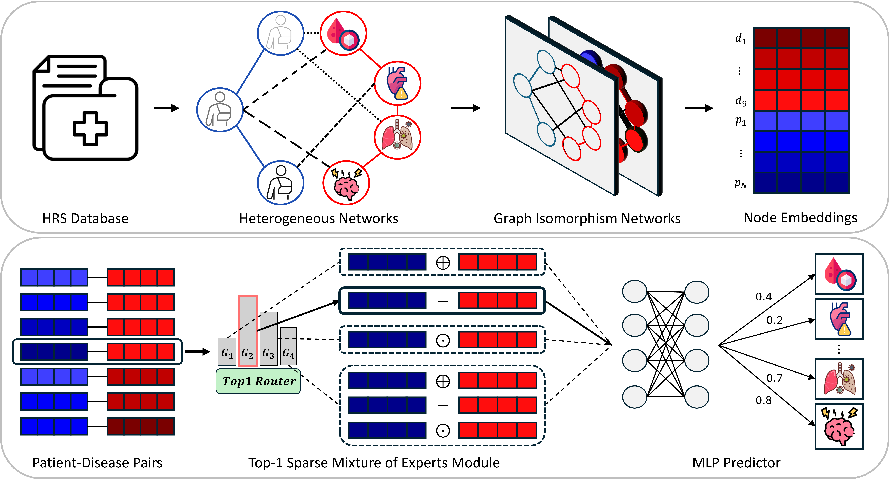

# Multimorbidity Prediction via a Mixture-of-Experts Approach on a Patient-Disease Network

## Abstract
- **Problem:** Multimorbidity refers to the co-occurrence of multiple chronic conditions and can strongly affect a patient’s health course and treatment decisions.
- **Challenge:** The large variety of disease combinations and their irregular progression make accurate prediction difficult with standard statistical models or deep learning approaches.
- **Gap in prior work:** Many studies rely mainly on clinical variables from EHRs, limiting the use of non-clinical factors such as social and environmental conditions.

- **Data:** Health and Retirement Study (HRS)
- **Key idea:** Build a patient–disease heterogeneous network and formulate multimorbidity prediction as link prediction (patient ↔ disease).
- **Methods:**
  - Use a **Graph Isomorhpism Network (GIN)** to learn node embeddings.
  - Use a **Mixture of Experts (MoE)** link predictor to model patient–disease interactions at the edge level.
  - The predictor has **four experts**, each combining node representations differently to capture complementary interaction patterns.

- **Results:**
  - Outperforms baseline methods; in the stroke group, improves AUROC by ~5.3% and AUPRC by ~4.43%.
  - Adding the MoE module improves performance by ~6.9% compared with the backbone model.

- **Insights:** Ablation and visualization analyses suggest the four-expert design encourages expert specialization and contributes to better prediction.

## Model Architecture

  

